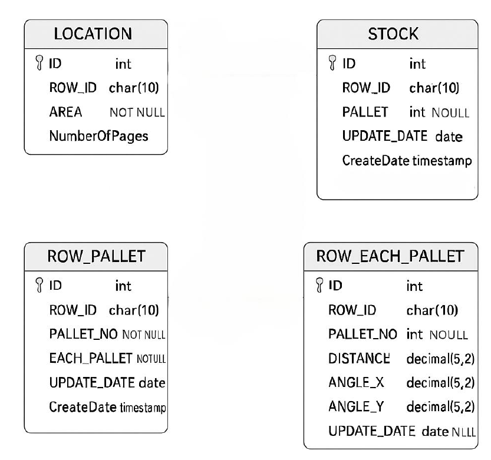

# **Database**

The database uses **MySQL**, a Relational Database Management System (**RDBMS**).

---

## **Tables**

1. **LOCATION**
    - **ROW_ID**: Row name
    - **AREA**: Depth of the row
    - **NumberOfPages**: Number of pages in the row

2. **STOCK**
    - **ROW_ID**: Row name
    - **PALLET**: Number of pallets in the row
    - **UPDATE_DATE**: Data update date (referenced from Pi time)
    - **CreateDate**: Timestamp (referenced from server)

3. **ROW_PALLET**
    - **ROW_ID**: Row name
    - **PALLET_NO**: Current page number of the row
    - **EACH_PALLET**: Number of pallets on the current page
    - **UPDATE_DATE**: Data update date (referenced from Pi time)
    - **CreateDate**: Timestamp (referenced from server)

4. **ROW_EACH_PALLET**
    - **ROW_ID**: Row name
    - **PALLET_NO**: Current page number of the row
    - **DISTANCE**: Measured distance
    - **ANGLE_X**: X-axis angle
    - **ANGLE_Y**: Y-axis angle
    - **UPDATE_DATE**: Data update date (referenced from Pi time)

---

