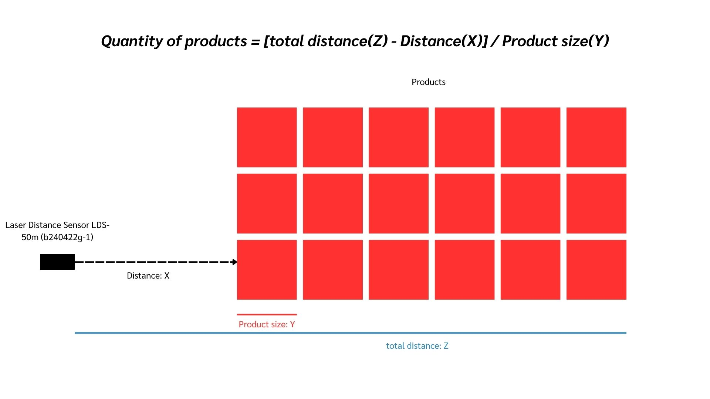
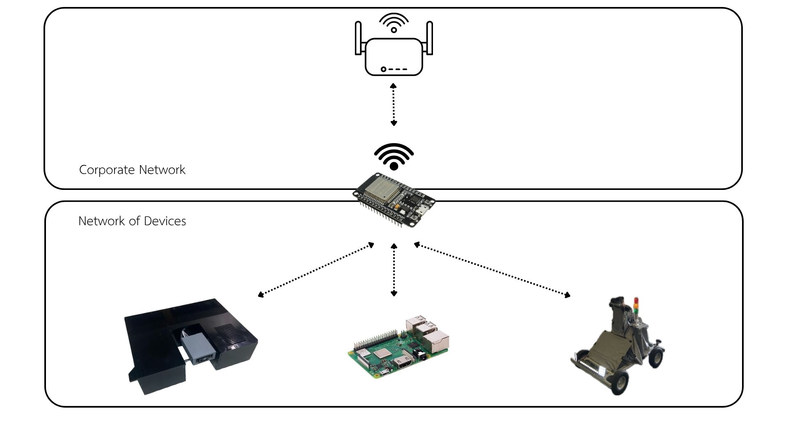
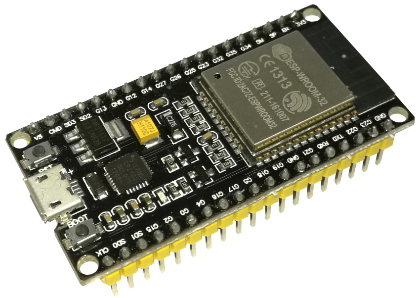
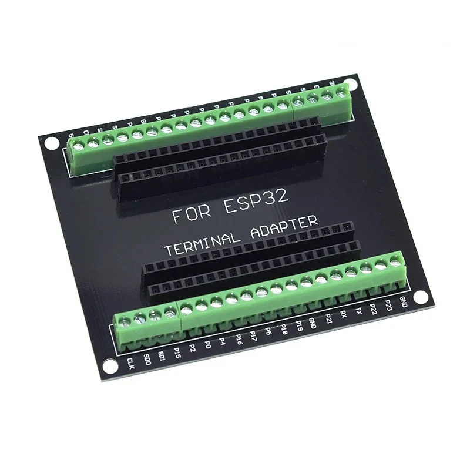
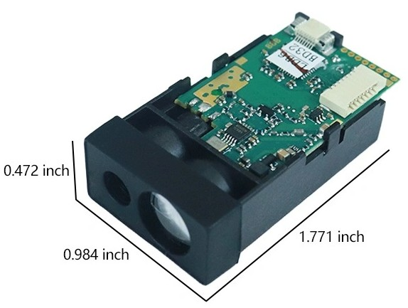
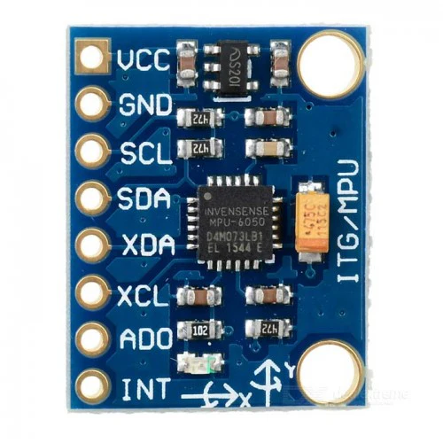
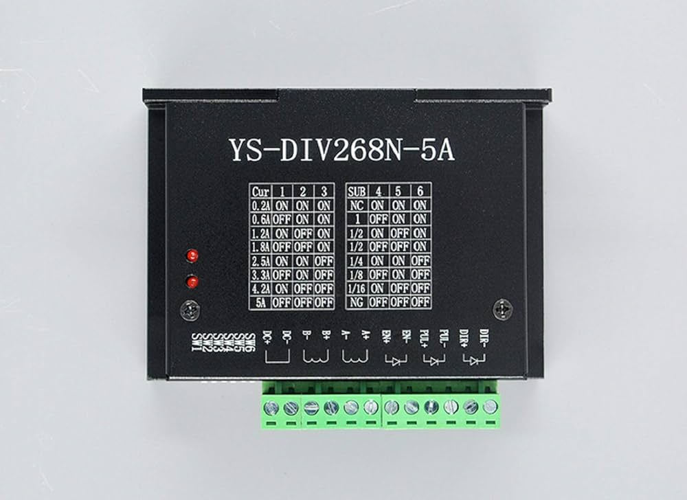
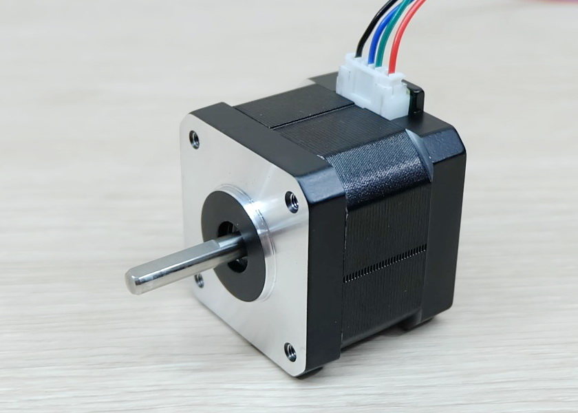
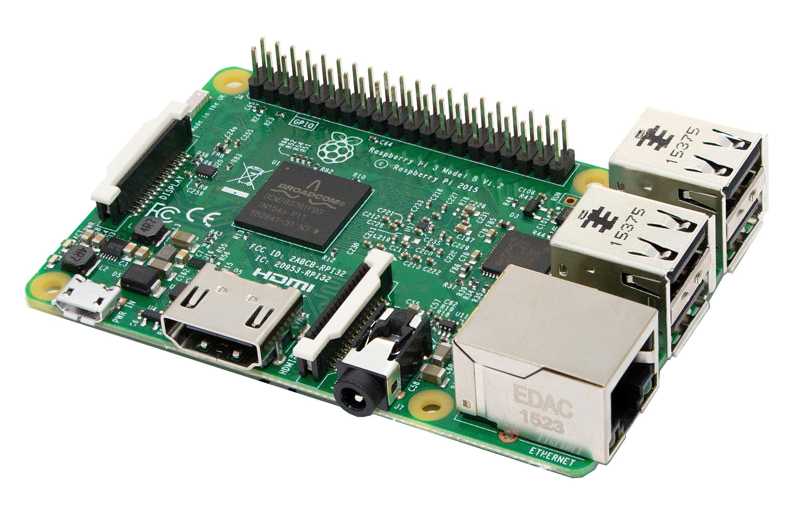
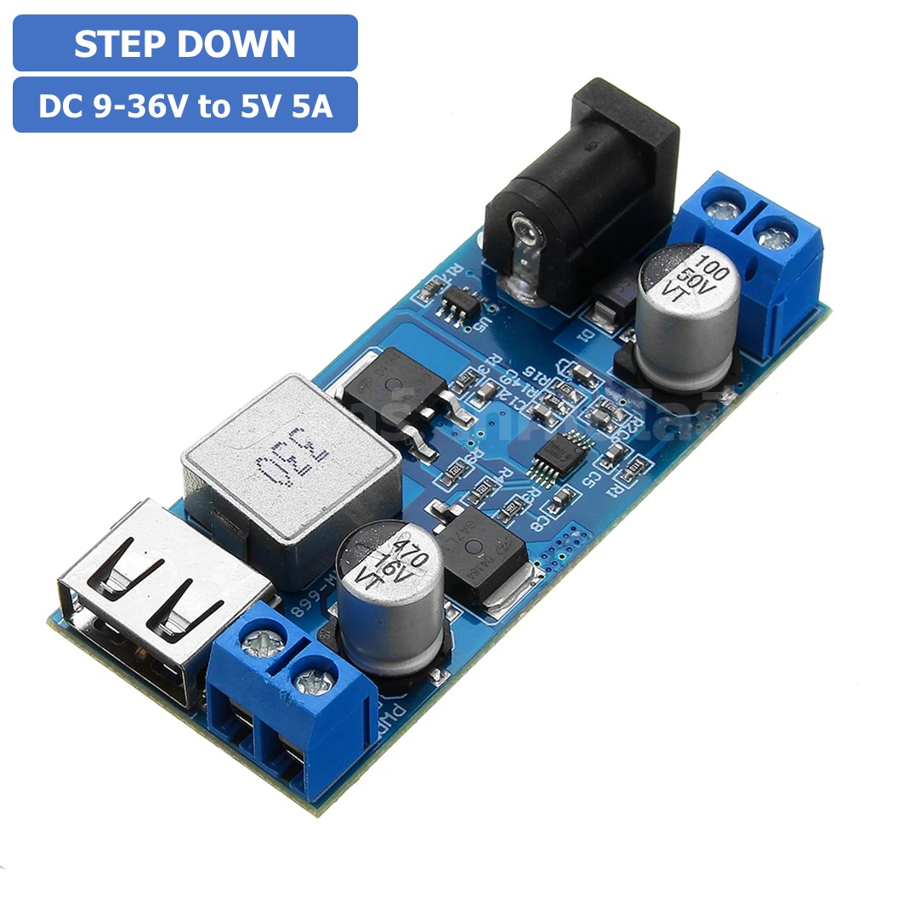

# **Product Quantity Monitoring Sensor**

This project utilizes the **Laser Distance Sensor LDS-50m (b240422g-1)** to measure distance and monitor the quantity of products. The products must have consistent dimensions and be arranged in a deep row. The main objective is to introduce technology into the industry to reduce costs and time spent counting products throughout warehouses.

The project includes API and network management systems to optimize traffic and data usage within factory or warehouse environments.All devices are connected via Wi-Fi, with data being sent via MQTT. To mitigate the complexity of connecting multiple devices within a corporate network, it is necessary to add one ESP32 device that connects to the corporate network, with all other devices connected to the network created by the ESP32. In order to store data and send it to the corporate network, the ESP32 has implemented NAT (Network Address Translation).

---

## **Project Structure**

- **Database**: Stores project data.
- **MQTT**: MQTT files.
- **src**: Source code for various parts of the project.
- **Example code sensor**: Sample code for device testing.
- **images**: Various images.

---

## **Devices Used**

- **ESP32**  
  
- **ESP32 Terminal Block Adapter Board Expansion 38pin**  
  
- **Laser Distance Sensor LDS-50m (b240422g-1)**  
  
- **MPU6050 Gyroscope**  
  
- **Drive motor YS-DIV268N-5A**  
  
- **Usongshine Nema17 Stepper Motor 0.9° Torque 42N.cm**  
  
- **Raspberry Pi 3**  
  
- **Step Down Module Buck Converter Fix 5VDC 5A LM2596S**  
  

---

## **Basic Functions and Principles**

- **ESP32** acts as a controller for the Laser Distance Sensor LDS-50m (b240422g-1) to measure distance and for the Drive motor YS-DIV268N-5A to control the Usongshine Nema17 Stepper Motor for up/down movement. The **MPU6050 Gyroscope** monitors the angle.
- The **Laser Distance Sensor LDS-50m (b240422g-1)** measures distance, and the **MPU6050 Gyroscope** measures angles. Data is transmitted via **MQTT** to the **Raspberry Pi 3**, which acts as an API to calculate values and determine the quantity of products.